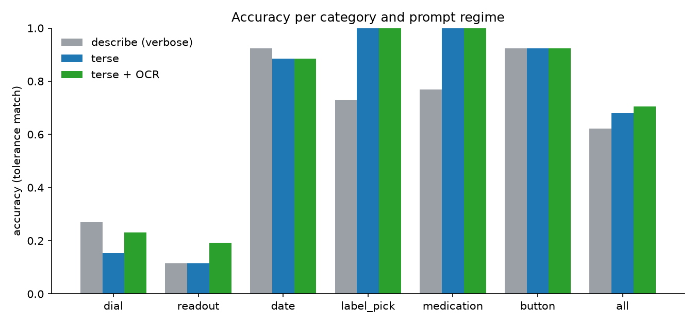
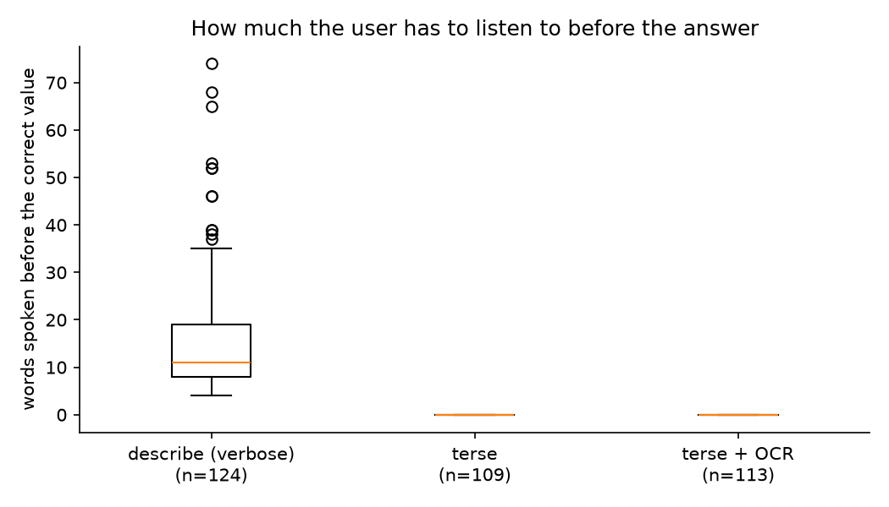
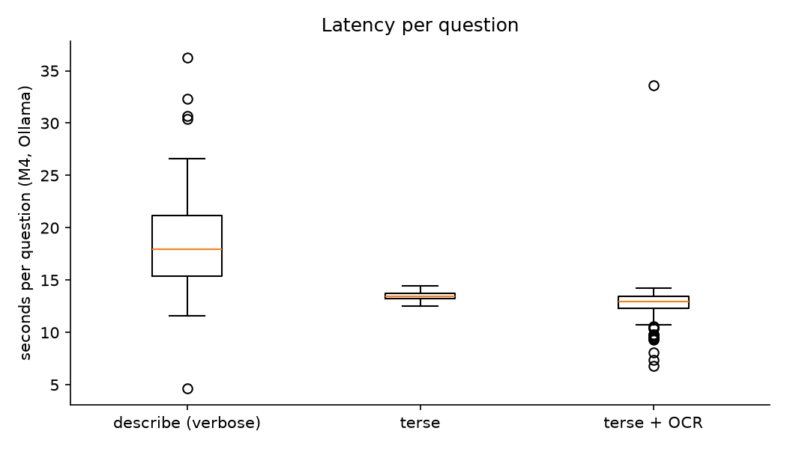
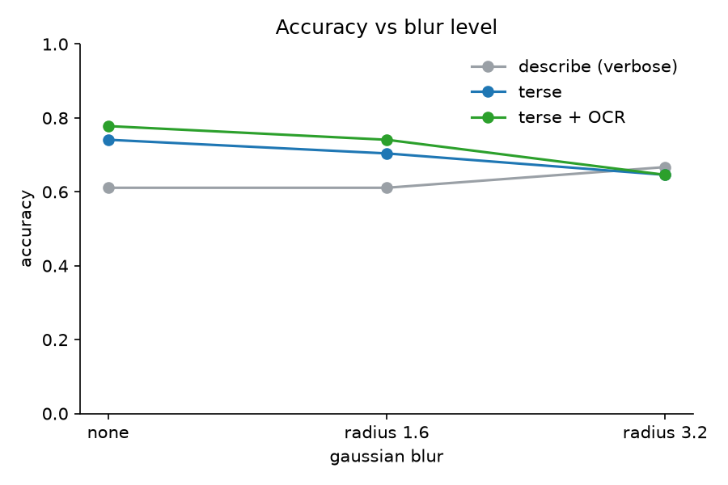

# one-answer-vision

Point the camera, ask one question, get one short answer, offline.

A small vision language model running locally through Ollama, prompted to answer a blind
user's question with the value and nothing else, and an evaluation of whether that short
answer is also a correct one, on the kinds of question people on r/Blind say they actually
ask: dials, digital readouts, best-before dates, which of two boxes, medication dosing
lines, and where a button is.

[](https://github.com/aghasalim/one-answer-vision/actions/workflows/ci.yml)

## Abstract

General assistants describe the whole scene before they get to the number, need a network
connection, and run on someone else's server. I built a tool that sends one image and one
question to `qwen3-vl:4b` on an Apple M4 through Ollama, with a prompt that asks for the
answer only, at most six words, and "I can't tell" as the allowed escape. I compared three
prompt regimes on a synthetic set of 156 labelled images in six categories: the default
"describe and answer" style, the terse answer-first prompt, and terse plus an OCR pre-pass
with the Mac's own text recogniser. Results are below, with the caveat that the test images
are drawn with PIL rather than photographed, so they are an upper bound.

## Results



156 synthetic images, 26 per category, one question each, `qwen3-vl:4b-instruct` through Ollama on an
Apple M4 (24 GB, no CUDA), temperature 0. Accuracy is a tolerance match on the first value in the
answer (rules in `METHODOLOGY.md`). Every number in this section is tagged and re-derived from
`results/summary.csv` and `results/by_blur.csv` by `scripts/check_numbers.py` in CI.

### Accuracy per category and prompt regime

| category | describe (verbose) | terse | terse + OCR |
|---|---|---|---|
| dial | <!-- num:acc_verbose_dial -->27<!-- /num -->% | <!-- num:acc_terse_dial -->15<!-- /num -->% | <!-- num:acc_terse_ocr_dial -->23<!-- /num -->% |
| readout | <!-- num:acc_verbose_readout -->12<!-- /num -->% | <!-- num:acc_terse_readout -->12<!-- /num -->% | <!-- num:acc_terse_ocr_readout -->19<!-- /num -->% |
| date | <!-- num:acc_verbose_date -->92<!-- /num -->% | <!-- num:acc_terse_date -->88<!-- /num -->% | <!-- num:acc_terse_ocr_date -->88<!-- /num -->% |
| label_pick | <!-- num:acc_verbose_label_pick -->73<!-- /num -->% | <!-- num:acc_terse_label_pick -->100<!-- /num -->% | <!-- num:acc_terse_ocr_label_pick -->100<!-- /num -->% |
| medication | <!-- num:acc_verbose_medication -->77<!-- /num -->% | <!-- num:acc_terse_medication -->100<!-- /num -->% | <!-- num:acc_terse_ocr_medication -->100<!-- /num -->% |
| button | <!-- num:acc_verbose_button -->92<!-- /num -->% | <!-- num:acc_terse_button -->92<!-- /num -->% | <!-- num:acc_terse_ocr_button -->92<!-- /num -->% |
| all | <!-- num:acc_verbose_all -->62<!-- /num -->% | <!-- num:acc_terse_all -->68<!-- /num -->% | <!-- num:acc_terse_ocr_all -->70<!-- /num -->% |



The terse prompt is at least as accurate as the describe prompt overall (<!-- num:acc_terse_all -->68<!-- /num -->% against
<!-- num:acc_verbose_all -->62<!-- /num -->%) and much better on the two text reading categories where the verbose answers
wander: label pick goes from <!-- num:acc_verbose_label_pick -->73<!-- /num -->% to <!-- num:acc_terse_label_pick -->100<!-- /num -->% and medication
from <!-- num:acc_verbose_medication -->77<!-- /num -->% to <!-- num:acc_terse_medication -->100<!-- /num -->%. Dates and buttons are read well in
every regime. Dials and 7-segment readouts are read badly in every regime: the best any regime gets on
dials is <!-- num:acc_verbose_dial -->27<!-- /num -->% and on readouts <!-- num:acc_terse_ocr_readout -->19<!-- /num -->%. On readouts the model very
often answers "888", which is what every segment lit looks like, so it is seeing the panel and not the
digits. On dials it either guesses a nearby number or refuses: the terse prompt says "I can't tell" on
<!-- num:cant_terse_dial -->46<!-- /num -->% of dials, and only <!-- num:cant_terse_all -->8<!-- /num -->% overall.

The OCR pre-pass (Apple Vision text through pyobjc) moves the overall figure from <!-- num:acc_terse_all -->68<!-- /num -->%
to <!-- num:acc_terse_ocr_all -->70<!-- /num -->%. The gain is on dials (<!-- num:acc_terse_dial -->15<!-- /num -->% to <!-- num:acc_terse_ocr_dial -->23<!-- /num -->%,
where the OCR hands the model the tick labels) and readouts (<!-- num:acc_terse_readout -->12<!-- /num -->% to
<!-- num:acc_terse_ocr_readout -->19<!-- /num -->%). It does nothing for dates, labels, medication and buttons, which the
model already reads itself. These are small differences on 26 images per category and I would not
build on them without a bigger set.

### Words before the answer

Mean answer length is <!-- num:words_verbose_all -->59.8<!-- /num --> words for
the describe prompt and <!-- num:words_terse_all -->2.1<!-- /num --> for the terse prompt. In the describe regime, when the right
value is in the answer at all, the user hears a median of <!-- num:wb_median_verbose_all -->12.0<!-- /num --> words before it (median
<!-- num:wb_median_verbose_dial -->38<!-- /num --> on dials, <!-- num:wb_median_verbose_readout -->15<!-- /num --> on readouts). In the terse regimes the median
is <!-- num:wb_median_terse_all -->0.0<!-- /num -->: the answer is the first thing said.



### Latency

Median wall clock per question during the evaluation run: <!-- num:lat_median_verbose_all -->18.0<!-- /num --> s describe, <!-- num:lat_median_terse_all -->13.4<!-- /num --> s
terse, <!-- num:lat_median_terse_ocr_all -->12.9<!-- /num --> s terse with OCR. Those terse numbers are not what the model needs. Another
process was running a second 4B model on the same Ollama server throughout the run, and
`results/latency_probe.csv` shows the cost: with the other model resident, Ollama reports about 12 s
of prompt evaluation per image (the image encoder is being pushed off the GPU); as soon as the other
model is evicted the same call takes 0.5 to 1.4 s wall clock. So on an idle M4 the terse answer comes
back in about a second, and under contention in about 13. The describe regime pays for its 300 token
budget on top of that.



### Blur

Accuracy by Gaussian blur level (radius 0, 1.6, 3.2), terse regime: <!-- num:blur0_terse -->72<!-- /num -->%, <!-- num:blur1_terse -->68<!-- /num -->%,
<!-- num:blur2_terse -->62<!-- /num -->%. With OCR: <!-- num:blur0_terse_ocr -->76<!-- /num -->%, <!-- num:blur1_terse_ocr -->72<!-- /num -->%, <!-- num:blur2_terse_ocr -->62<!-- /num -->%.
The describe regime is flat at <!-- num:blur0_verbose -->61<!-- /num -->%, <!-- num:blur1_verbose -->61<!-- /num -->%, <!-- num:blur2_verbose -->65<!-- /num -->%,
which says more about its errors being elsewhere than about blur.



### Negative results

* The thinking variant `qwen3-vl:4b` ignores `think: false` in Ollama 0.35 and returns an empty answer
  inside a 40 token budget. With a 2000 token budget it got 10 of 12 probe images right but took 9 to
  57 s each with 40 to 315 words of reasoning first (`results/thinking_probe.csv`). Unusable for this.
* 7-segment readouts are a wall for this model at this size: it reads the lit shape as "888".
* OCR does not fix dials. Knowing the tick labels does not tell you where the pointer is.

## What blind users actually asked for

Three posts from r/Blind that set the scope of this project, quoted as written:

> "AI is so convoluted in it's descriptions that calling someone is waaay faster, E.G, I need to know the exact position of the water level dial of my coffee machine... it'll describe absolutelly everything before saying the water level and usually it will say it wrong."
> https://www.reddit.com/r/Blind/comments/1vyh4dv/

> "1) Privacy - I can't trust Meta... 2) They need always online connection" and "If there were something open source, even if it were bulkier and a little clunkier, I'd be way more comfortable with that."
> https://www.reddit.com/r/Blind/comments/1nqw16e/

> "i'm using qwen3vl-2b model to describe images via nvda script. takes 10s on my laptop with no gpu."
> https://www.reddit.com/r/Blind/comments/1txha0r/

The first one is the "words before answer" metric. The second one is why everything here is
local. The third one is the latency budget I am comparing against.

## Limitations

* The test set is synthetic. Dials, 7-segment panels and labels are drawn with PIL from a
  seed, so the ground truth is exact and the set is reproducible, but there is no glare,
  no hand in the frame, no perspective and no partial framing. Real phone photos from blind
  users will be harder and are the next step.
* One small model (`qwen3-vl:4b`), one machine, one run per image at temperature 0.
* No blind user has used this yet. The three quotes above are the only user input.
* The scorer takes the first number (or the first "left"/"right") in the answer. A verbose
  answer that says a wrong number before the right one is counted wrong. That is what the
  user hears first, but it does mean the verbose regime is penalised for length twice.
* I looked for a free real 7-segment or dial photo set with clear labels and a licence to
  add as a real subset and did not find one I could use in the time I had.

## How to run

Needs a Mac (for the Apple Vision OCR path; without it the tool still runs, just without
OCR) and [Ollama](https://ollama.com).

```
ollama pull qwen3-vl:4b
python3 -m venv .venv && .venv/bin/pip install -r requirements.txt && .venv/bin/pip install -e .

oav ask data/images/dial_000.png "What temperature is the oven dial set to?"
oav ask photo.jpg "what is the best before date" --ocr --time
oav watch "what does the display say"        # webcam, space to ask, q to quit
```

Output is plain text, the answer on the first line and nothing else, so a screen reader
reads the answer and stops.

To regenerate the test set and the results:

```
.venv/bin/python -m oav.generate data          # 156 images, seed 20260101
.venv/bin/python scripts/run_eval.py           # all three regimes, resumable, writes results/raw.csv
.venv/bin/python scripts/summarise.py          # results/summary.csv, results/by_blur.csv
.venv/bin/python scripts/make_figures.py       # results/*.png
.venv/bin/python scripts/check_numbers.py      # fails if a number in this README drifts from the CSVs
.venv/bin/python -m pytest
```

`METHODOLOGY.md` has the match rules per category and the threats to validity.
`notes/LOGBOOK.md` has the dated notes, including what did not work.

## Privacy

Nothing leaves the machine. The image goes to the Ollama server on localhost and to the
operating system's text recogniser. There are no API keys, no accounts and no telemetry.
The repo contains no photos of people or of anyone's home; every image in `data/` is
generated.

## Licence

MIT.
